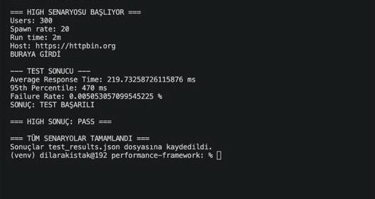

# 🚀 Performance Testing Framework (Locust + Python)

## 📌 Overview

This project is an automated performance testing framework built using Locust.

It supports:

- Multi-scenario load testing (low / medium / high)
- Threshold-based validation
- Automated PASS/FAIL decision making
- JSON result storage
- Markdown report generation

---

## ⚙️ Tech Stack

- Python
- Locust
- JSON
- Markdown Reporting

---

## 🧪 Scenarios

| Scenario | Users | Spawn Rate | Duration |
| -------- | ----- | ---------- | -------- |
| Low      | 10    | 2          | 30s      |
| Medium   | 100   | 10         | 1m       |
| High     | 300   | 20         | 2m       |

---

## 📊 Example Report

See `REPORT.md` for generated output.

---

## 🧠 Key Features

- Automated threshold validation (avg, p95, failure rate)
- Exit codes for CI/CD integration
- Structured test orchestration
- Clean reporting layer

---

## 🚀 How to Run

```bash
python3 run_tests.py
python3 generate_report.py
---

## 📈 Why This Matters

In real-world systems:

- High response times = poor user experience
- High failure rates = lost revenue
- Lack of automation = unreliable releases

This framework ensures:

✔ Performance is validated automatically
✔ Bottlenecks are detected early
✔ Systems are production-ready before release

---

## 📊 Performance Test Result


---


Results from automated load tests across low, medium, and high scenarios.

## 📊 Performance Test Result




